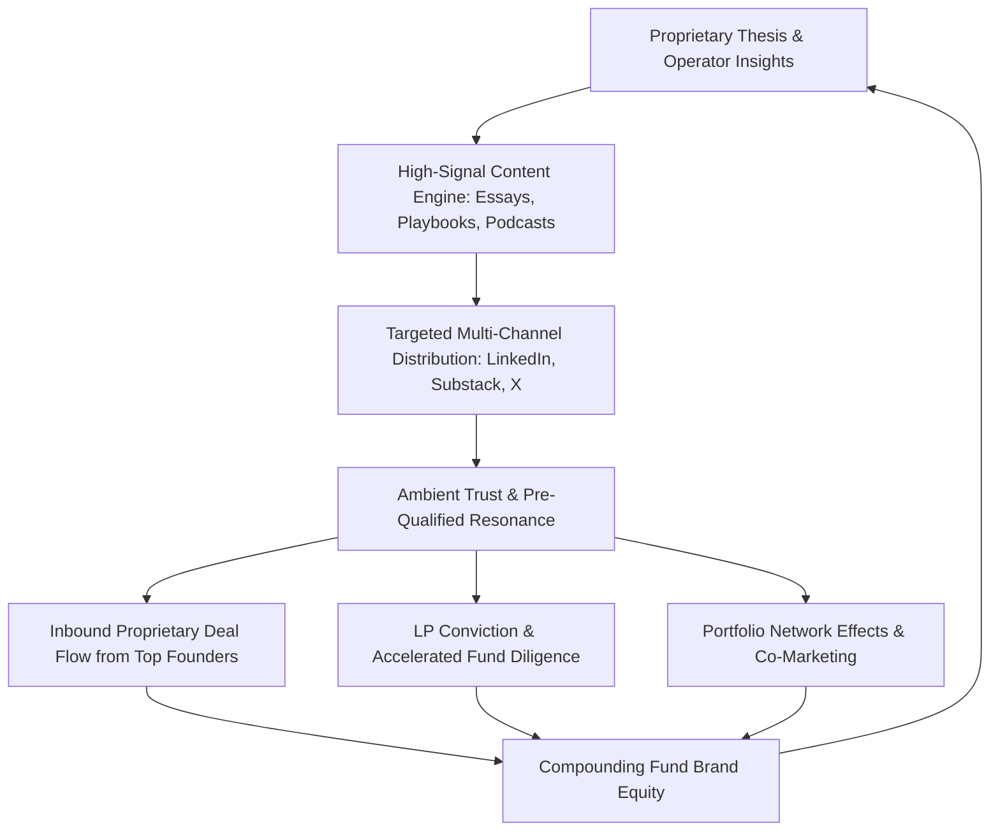

# VC Fund Content Marketing Strategy: Driving Inbound Deal Flow for Emerging Managers

---

## Executive Synthesis & VC Strategic Analysis

### The Paradigm Shift: From Capital Commodity to Inbound Deal Flow Magnet
In the contemporary venture capital ecosystem, capital is increasingly commoditized. With thousands of micro-VCs and emerging managers competing for early-stage allocations alongside multi-stage giants, standard marketing claims such as "founder-friendly" and "value-add" carry zero differentiation. Venture returns follow strict power-law distributions—where the top 2% of venture capital funds capture roughly 95% of industry returns. For emerging managers (Funds I through III), breaking into this upper echelon requires establishing proprietary access to top-decile founders before competitive, multi-firm bidding auctions begin.

Content marketing has transformed from an ad-hoc PR activity into a mission-critical **operational front door** and **asymmetric inbound sourcing engine**. Instead of spending endless hours chasing outbound cold outreach with diminishing response rates, emerging managers use high-signal, utility-driven content to generate inbound deal pull, build ambient trust, and shorten the founder diligence cycle.

---

### Core Strategic Pillars for Emerging Managers

1. **Utility-First Architecture ("Solve, Don't Just Sell"):**
   The most effective content strategies in venture capital (modeled after industry benchmarks like *First Round Review* and Bessemer’s *State of the Cloud*) deliver tactical, operational utility rather than self-congratulatory deal announcements. When an emerging manager provides actionable playbooks on pricing models, go-to-market motions, or hiring frameworks, they prove their capability before signing a term sheet.

2. **The "Always-On" Diligence Pitch Deck:**
   Founders conduct rigorous diligence on investors before accepting capital. A well-maintained content archive serves as an "always-on" digital storefront. It clearly articulates the fund's investment thesis, decision-making framework, and cultural values, pre-qualifying inbound leads and establishing the investor as "smart money."

3. **The 50/50 Content Production vs. Distribution Rule:**
   Great content without distribution creates zero deal flow. High-performing VC marketing operations allocate at least 50% of their creative bandwidth and capital to distribution across owned channels (email newsletters, Substack), rented networks (LinkedIn, X, specialized podcasts), and ecosystem syndication.

4. **Personal Partner Brand vs. Firm Lore Balance:**
   Early-stage venture capital is fundamentally an individual relationship business. Emerging managers must leverage the authentic personal voices and domain expertise of individual GPs while weaving a cohesive institutional lore that builds enduring firm value across fund vintages.

5. **Strategic Attribution Over Vanity Metrics:**
   Emerging managers must avoid chasing vanity metrics such as raw page views or social media likes. Success is measured by pipeline attribution: the percentage of qualified inbound pitches aligning with the fund's thesis, conversion rates to diligence, and founder sentiment during initial pitch meetings.

---

## Selected Authoritative Articles

---

### Article 1: The Ultimate Guide to Content Marketing for Venture Capital Firms

* **Source:** *Collective Campus*
* **Author:** Steve Glaveski (CEO & Co-Founder, Collective Campus; Author & Venture Partner)
* **URL:** `https://www.collectivecampus.io/blog/the-ultimate-guide-to-content-marketing-for-venture-capital-firms`

---

#### Full Text

### Introduction: Why VC Content Marketing Matters
It is no secret that the venture capital landscape is more crowded than ever before. With record amounts of dry powder and thousands of funds globally, capital alone is no longer a competitive advantage. It is a commodity.

To win the best deals, build enduring partnerships, and generate top-tier returns, venture capital firms need deal flow—specifically, proprietary and high-signal inbound deal flow. However, many venture capital firms take a borderline negligent approach to their marketing strategy. They publish occasional press releases when they lead a Series A round, tweet sporadic congratulations to portfolio founders, and leave their firm websites stagnant for years.

In an industry governed by power laws, where a tiny fraction of investments generate the lion's share of fund returns, waiting for deals to land in your inbox through warm introductions from the same tight circles is a losing strategy. You need a systematized **content marketing machine**.

Content marketing for venture capital is not about hard-selling; it is about building deep, scalable trust, establishing undeniable thought leadership, and stimulating inbound conversations with two critical stakeholders: **high-potential founders** and **prospective Limited Partners (LPs)**.

---

### 1. Strategy & Objective Setting
Before publishing a single word, an emerging or established VC firm must define what success looks like. Treating content marketing as a discretionary PR exercise leads to burnout and inconsistent publishing.

#### Core VC Objectives
* **Generate High-Quality Inbound Deal Flow:** Attracting founders who align precisely with your fund's core thesis and focus stage before they enter broad, multi-bidder fundraising processes.
* **Accelerate Founder Diligence & Trust:** Shortening the time required to close competitive deals because the founder is already familiar with your thinking, philosophy, and reputation.
* **Nurture LP Relationships:** Demonstrating domain expertise, market intelligence, and disciplined capital allocation to existing and prospective LPs ahead of your next fundraise.
* **Amplify Portfolio Companies:** Providing your portfolio founders with platform distribution, talent recruitment reach, and customer lead generation.

Treat your content marketing strategy as a compounding long-term investment. Just like venture investments take 7 to 10 years to mature, a robust content engine requires 6 to 12 months of consistent execution before compounding returns become evident in your deal pipeline.

---

### 2. Identifying Target Personas
A generic message aimed at "the tech startup ecosystem" appeals to no one. High-performing VC content is sharply targeted at distinct buyer personas:

1. **The Early-Stage Founder:**
   * *Pain Points:* Product-market fit discovery, initial customer acquisition, seed-stage hiring, dilution management, and navigating subsequent funding rounds.
   * *Content Needs:* Tactical frameworks, teardowns of successful go-to-market playbooks, hiring scorecards, and transparent term sheet explanations.

2. **The Prospective Limited Partner (LP):**
   * *Pain Points:* Fund manager differentiation, track record validation, market cycle resilience, and operational discipline.
   * *Content Needs:* Deep-dive industry macro analyses, portfolio construction philosophy, return distributions, and thesis defensibility papers.

3. **The Co-Investor & Scout Ecosystem:**
   * *Pain Points:* Finding high-conviction syndicate partners with complementary domain expertise.
   * *Content Needs:* Collaborative research, sector market maps, and syndication insights.

---

### 3. Choosing Content Mediums & Formats
Venture capitalists possess unique access to cutting-edge technology trends, executive talent, and market data. Translating this access into engaging content formats is essential:

* **Long-Form Thesis Essays & Market Maps:** Detailed, data-backed reports analyzing an emerging sector (e.g., enterprise AI infrastructure, climate tech supply chains, or B2B fintech workflows). These establish categorical authority and act as magnets for specialized founders.
* **The Operator Playbook (First Round Review Model):** Granular, how-to articles derived from interviews with portfolio operators, detailing how they solved specific scaling bottlenecks.
* **Podcasts and Audio Interviews:** Hosting a niche podcast (such as NextView's *Traction* or *20VC*) creates deep parasocial relationships with founders who listen to partners discuss tactical challenges week after week.
* **Short-Form Insights (LinkedIn & X Threads):** Distilling complex venture concepts into bite-sized, high-signal social posts that drive awareness back to owned media channels.
* **Curated Newsletters:** An owned weekly or bi-weekly publication that provides filtered signal directly to the subscriber's inbox.

---

### 4. Topic Selection & Value Delivery
The golden rule of venture content is: **Utility over Self-Promotion**.

Founders do not care about your fund's internal partner promotions or generic congratulatory announcements. They care about solving the immediate, high-stakes problems threatening their company's survival.

Focus your editorial calendar on topics such as:
* *Zero-to-One Validation:* How to land your first 10 enterprise pilot customers without a brand.
* *Unit Economics & Pricing:* Developing scalable pricing models for usage-based SaaS.
* *Fundraising Mechanics:* How early-stage VCs actually evaluate TAM, retention cohorts, and pitch decks during partner meetings.
* *Case Studies on Failure:* Candid analyses of lessons learned from portfolio setbacks and operational pivots.

---

### 5. Distribution Architecture & Systematic Promotion
Creating exceptional content is only half the battle. If nobody reads it, it will not generate a single term sheet. A robust distribution architecture involves:

1. **Owned Channels First:** Build your proprietary email subscriber base via Substack, beehiiv, or your website CRM. Social platforms can change algorithms overnight, but your email list is an owned asset.
2. **Social Amplification:** Repurpose every long-form essay into 3–5 LinkedIn posts, Twitter/X threads, and short video clips for the partners' personal accounts.
3. **Syndication & Community Seeding:** Distribute research through targeted Slack and Discord communities, Hacker News, Medium, and startup hubs.
4. **Direct Outreach Integration:** Equip your investment associates and principals with content assets to use as value-add follow-ups after initial pitch calls.

---

### 6. Measuring ROI and Deal Flow Attribution
Avoid getting trapped in vanity metrics. A million views on social media from consumers is worth far less to a venture fund than 50 reads from qualified Seed-stage founders building in your target sector.

Track metrics that directly impact your fund's bottom line:
* **Qualified Inbound Volume:** Percentage of inbound pitch decks that strictly match your sector and stage thesis.
* **Founder Touchpoint Attribution:** How many prospective founders cite a specific article, podcast, or newsletter issue during initial intro calls.
* **Win Rate in Competitive Rounds:** Did your firm's published thought leadership persuade the founder to choose your term sheet over a competing offer?
* **LP Pipeline Inquiries:** Inbound meeting requests from family offices, fund-of-funds, and institutional LPs referencing your market analyses.

By building a disciplined content engine, venture capital firms transition from reactive, manual sourcing to an automated inbound deal flow engine that compounds across fund lifecycles.

---

---

### Article 2: Venture Capital Content Marketing: 7 Powerful Wins for Inbound Deal Flow

* **Source:** *Elasticity (GoElastic)*
* **Author:** *Elasticity Strategy Team*
* **URL:** `https://goelastic.com/content-marketing-venture-capital-7-powerful-wins-in-2025/`

---

#### Full Text

### The New Reality of Venture Capital Sourcing
The venture capital ecosystem is undergoing a structural realignment. With over 600 active micro-VCs and thousands of angel syndicates launching over the past decade, founders have unprecedented access to early-stage capital. 

The data is sobering: the top 2% of VC firms capture roughly 95% of venture returns. The firms dominating this top bracket do not rely solely on traditional country-club networks or reactive deal introductions. Instead, they operate sophisticated media, content, and platform engines designed to capture mindshare and generate inbound deal flow at scale.

For emerging managers, content marketing is no longer an optional luxury—it is an existential requirement for building fund brand equity and attracting high-conviction founders. Below are seven powerful strategic wins that forward-thinking venture capital firms use to dominate their category.

---

### Win 1: Transitioning from Outbound Hustle to Inbound Pull
Traditional venture sourcing relies heavily on brute-force outbound prospecting: scraping AngelList, LinkedIn, and GitHub, sending thousands of cold emails, and attending endless networking mixers. While outbound sourcing has its place, it suffers from severe diminishing returns and low conversion rates.

A systematic content marketing engine creates **gravitational pull**. By publishing rigorous thesis pieces, proprietary market data, and tactical operator guides, you signal domain expertise to founders long before they start actively fundraising. When founders in your sector decide to raise capital, your fund is already at the top of their target list, transforming cold outreach into warm inbound inbound inquiries.

---

### Win 2: The "Always-On" Diligence Pitch Deck
Founders today conduct deep due diligence on investors. Before taking an introductory call or accepting a term sheet, an entrepreneur will review your website, read your articles, check your social media commentary, and analyze your portfolio interactions.

Your content functions as an **always-on pitch deck** that operates 24/7/365. It communicates:
* How you think about market opportunities and technological inflections.
* How you support founders during difficult operational moments.
* The exact profile of startups you back (preventing mismatched inbound).
* What makes your partnership uniquely valuable compared to a generic check.

---

### Win 3: Prioritizing Partner Personal Brands Over Corporate Facades
One of the most common mistakes emerging VC funds make is hiding behind a polished, corporate firm brand. Early-stage venture capital is fundamentally a people business. Founders do not partner with logos or legal entities; they partner with individual human beings who will sit on their board and guide them through crises.

Successful venture firms empower individual General Partners, Principals, and Associates to build distinct personal brands on platforms like LinkedIn, Substack, and X. A partner sharing candid perspectives, lessons from the trenches, and authentic industry breakdowns consistently achieves 10x to 20x the engagement of a faceless firm account.

---

### Win 4: Utility-First Content that Solves Real Operator Problems
Generic thought leadership consisting of shallow buzzwords ("AI will disrupt everything") adds zero value and damages your fund's credibility with technical founders. To win founder trust, your content must provide concrete, high-leverage utility.

Focus on the "operator stack":
* **Hiring & Compensation Benchmarks:** Real data on equity grants and executive packages for seed-to-Series A transitions.
* **Go-To-Market Mechanics:** Detailed blueprints for outbound enterprise sales funnels or PLG onboarding loops.
* **Technical Infrastructure Reviews:** Deep dives into architectural trade-offs, tech stacks, and cloud cost management.

When your content helps a founder build a better company for free, you become their first call when they need capital to scale it.

---

### Win 5: The 50% Rule for Content Distribution
A widespread failure point for venture funds is spending 95% of their effort creating a 3,000-word research whitepaper and only 5% distributing it—resulting in a single tweet and an unread PDF on a dormant website.

Top-tier firms follow the **50% Rule**: allocate at least 50% of your time, resources, and budget to distribution. This includes:
* Slicing long-form whitepapers into short-form LinkedIn carousels, infographics, and executive summaries.
* Syndicating key takeaways across industry newsletters, niche podcasts, and operator communities.
* Building an owned email newsletter engine where content lands directly in subscriber inboxes without algorithmic filtering.
* Direct distribution by investment team members during sourcing calls and founder follow-ups.

---

### Win 6: Creating a Virtuous Cycle with Portfolio Co-Marketing
Your portfolio companies are your greatest marketing asset. By involving portfolio founders in collaborative content—such as case studies, joint research reports, technical webinars, and podcast interviews—you create a self-reinforcing flywheel:
1. You provide free visibility and customer lead generation to your portfolio company.
2. The portfolio founder shares the content with their peer network of high-caliber entrepreneurs.
3. Prospective founders observe how actively you support your companies and seek you out for their next round.

This transforms portfolio support into a high-octane deal-sourcing mechanism.

---

### Win 7: Managing Regulatory Compliance Without Editorial Paralysis
Many venture capital funds hesitate to publish content due to regulatory concerns surrounding SEC regulations, general solicitation rules (Rule 506(b) vs. Rule 506(c)), and performance marketing restrictions.

Leading firms overcome this by establishing clear, documented compliance guardrails:
* Focus publicly on macroeconomic trends, operational playbooks, and market theses rather than specific fund internal rates of return (IRR) or fundraising solicitations.
* Clearly delineate between educational thought leadership and private fund marketing materials.
* Implement structured editorial review workflows that enable fast turnarounds while maintaining legal safety.

---

### Summary Table: VC Content Marketing Strategy Matrix

| Strategic Element | Traditional VC Approach | Modern Content-First VC Approach |
| :--- | :--- | :--- |
| **Sourcing Model** | Reactive warm intros & brute-force cold emails | Inbound pull driven by published theses and playbooks |
| **Brand Focus** | Stiff corporate logo and press releases | Authentic partner personal brands + institutional lore |
| **Content Type** | Self-congratulatory deal announcements | Operator-centric utility, data teardowns, and tactical guides |
| **Distribution** | Sporadic social tweets & static website posts | 50% rule: multi-channel syndication, newsletters, audio/video |
| **Primary Metric** | Vanity PR mentions & social impressions | Qualified thesis-aligned inbound deal flow & LP pipeline |

---

### Conclusion
In the modern venture economy, your content is your investment thesis made public. For emerging managers looking to scale from Fund I to enduring multi-generational franchises, investing in a structured, utility-driven content machine is the single highest-ROI strategy for generating proprietary deal flow and establishing market leadership.
