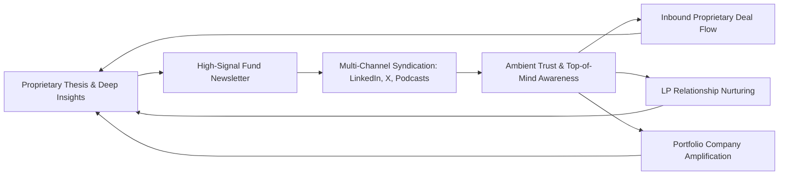

# Building a Newsletter as a VC Fund Content Distribution Engine

---

## Executive Synthesis & VC Strategic Analysis

### The Paradigm Shift: From Passive Capital to Media-First Distribution
In an increasingly crowded venture landscape where dry powder is abundant and capital is commoditized, the primary differentiator for venture capital funds has shifted toward **distribution, proprietary deal access, and brand resonance**. Traditional outbound sourcing and passive portfolio announcements are no longer sufficient to attract top-tier founders. 

Modern venture funds are adopting the **"VC-as-a-publisher" model**, pioneered by firms like Andreessen Horowitz (a16z), First Round Capital, and OpenView. Central to this strategy is the **fund newsletter**, serving as the operational "front door" and distribution engine of the firm.

---

### Core Strategic Pillars of VC Newsletter Distribution

1. **The "Inbox as the Front Door" & Ambient Trust:**
   Venture capital is inherently relationship-driven and conducted within email inboxes. A high-signal newsletter creates continuous, low-friction touchpoints that build **ambient trust**. Rather than transactional "cold outreach," founders and co-investors interact with the fund's thinking over weeks and months. When founders decide to raise, the fund is already top-of-mind.

2. **Audience Segmentation & Newsletter Taxonomy:**
   High-performing venture firms avoid one-size-fits-all newsletters, segmenting content into clear streams:
   * **General / Industry-Facing (Weekly/Bi-weekly):** Investment theses, deep tech/sector teardowns, and market analyses designed to attract prospective founders and build ecosystem authority.
   * **Portfolio Support (Monthly):** Practical frameworks, hiring boards, playbooks, and tactical operator guides.
   * **LP & Co-Investor Updates (Quarterly):** Transparent portfolio milestones, fund performance, and market outlooks to cement LP conviction for subsequent fundraises.

3. **The Content Flywheel & Syndication Architecture:**
   The newsletter functions as the central hub of a broader content distribution flywheel. A single long-form thesis or case study is modularized into bite-sized LinkedIn breakdowns, X threads, podcast discussions, and operator toolkits, driving audience acquisition back to the newsletter subscriber base.

4. **Metrics That Matter Beyond Vanity Numbers:**
   Unlike consumer media brands focused purely on open rates and vanity subscriber counts, VC funds evaluate newsletters on strategic outcomes:
   * **Inbound deal flow velocity & quality** (founders referencing specific newsletter pieces during pitch meetings).
   * **Co-investment and syndicate syndication** (inbound requests from peer funds to co-lead rounds).
   * **Portfolio amplification efficacy** (customer introductions, talent acquisition, and press visibility generated for portfolio companies).

---

## Selected Authoritative Articles

---

### Article 1: Why VCs Are Launching Newsletters for Deal Flow

* **Source:** *beehiiv Blog*
* **Author:** *beehiiv Editorial Team*
* **URL:** `https://www.beehiiv.com/blog/why-vcs-are-launching-newsletters-for-deal-flow`

---

#### Full Text

In modern venture capital, attention is the new oil. 

As competition for the best startup deals intensifies across early and growth stages, venture capitalists are realizing that capital alone is no longer a sustainable moat. Money is a commodity. To win allocations in competitive rounds, investors need brand recognition, founder alignment, and consistent top-of-mind awareness.

Enter the email newsletter. Once considered a simple marketing chore or an administrative quarterly obligation for Limited Partners (LPs), the newsletter has transformed into the primary deal flow engine and distribution asset for forward-thinking venture capital firms.

---

#### 1. The Attention Economy in Venture Capital
Venture capital operates on power laws—not just in returns, but in deal flow. The top 1% of founders receive inbound term sheets from dozens of firms. To win these deals, funds must create a compelling "bat signal" that clearly communicates their thesis, operating philosophy, and sector expertise long before a founder enters fundraising mode.

Traditional PR and sporadic press releases announcing closed rounds provide temporary spikes in visibility, but they fail to build sustained engagement. A newsletter provides an owned, direct-to-consumer channel that bypasses third-party media gatekeepers and algorithm changes on social networks.

---

#### 2. The Inbox is the "New Front Door"
Founders, angel investors, venture partners, and limited partners all run their professional lives inside their inboxes. Pitch decks, term sheets, board updates, and introductions all happen via email.

By securing real estate inside a founder's inbox on a weekly or bi-weekly basis, a venture firm moves from being an occasional external transactional actor to a regular, trusted voice. This creates what marketing strategists call **ambient trust**:
* When an entrepreneur decides it is time to raise their Seed or Series A round, the firm that provided regular, actionable market insights is already familiar and credible.
* The friction to initiate a conversation is dramatically reduced; founders simply reply directly to a newsletter edition.

---

#### 3. Strategic Editorial Formats for Venture Funds
Successful venture newsletters generally deploy one of four distinct editorial architectures:

1. **The Thesis Deep-Dive (The Essay):**
   * **Length:** 800–1,500 words.
   * **Focus:** Deep analytical teardowns of emerging markets (e.g., vertical AI agents, nuclear fission, B2B SaaS pricing models).
   * **Goal:** Demonstrates deep domain expertise, signaling to founders in that niche that the investor understands their technical and commercial bottlenecks.

2. **The Curated Roundup:**
   * **Length:** 400–800 words.
   * **Focus:** Curated ecosystem intelligence, including notable funding rounds, regulatory shifts, open-source repository breakthroughs, and executive talent moves.
   * **Goal:** Establishes the fund as a high-signal filter for busy operators.

3. **The Operator Playbook (Tactical How-To):**
   * **Length:** 1,000–2,000 words.
   * **Focus:** Real-world case studies on hiring executive teams, structuring sales compensation, or setting up product-led growth loops.
   * **Goal:** Proves tangible "value-add" beyond capital, showcasing the fund's operational platform.

4. **The General Partner Personal POV:**
   * **Length:** 300–600 words.
   * **Focus:** Candid reflections on founder psychology, market cycles, board governance, and counter-intuitive investment lessons.
   * **Goal:** Humanizes the partnership and builds personal connection with founders.

---

#### 4. Growth Engines and the Distribution Tech Stack
Modern venture capital newsletters leverage modern newsletter infrastructure (such as beehiiv) to turn publications into growth engines:
* **Built-in Referral Programs:** Incentivizing founders and operators to share the newsletter with peers in exchange for exclusive market benchmarks or founder directory access.
* **Audience Segmentation:** Tagging subscribers as founders, co-investors, LPs, or job seekers to deliver customized content and invitations to private dinners or demo days.
* **Data-Driven Feedback Loops:** Tracking link clicks on specific industry sectors to identify emerging sub-sectors where founders are actively clicking, informing future fund theses.

---

#### 5. Real-World Case Studies
* **StrictlyVC:** Built a must-read daily digest of Silicon Valley venture deals, subsequently scaling into major events and exclusive industry access.
* **Tomasz Tunguz / Theory Ventures:** Leverages data-driven regression analyses and benchmark charts in daily/weekly essays, positioning the fund as the authoritative analytical voice in SaaS and enterprise software.
* **Confluence VC:** Transformed a curated community newsletter into a deal syndication and peer network for hundreds of junior and senior venture investors.

---

#### 6. Summary Playbook for Launching a VC Newsletter
1. **Define Your Specificity:** Do not build a generic "VC news" digest. Focus sharply on your fund's core thesis and superpower.
2. **Prioritize Signal Over Volume:** High-conviction, proprietary data and well-researched viewpoints outperform superficial commentary.
3. **Embed Clear Calls-to-Action (CTAs):** Encourage founders building in the space to hit "Reply" with pitch decks or ideas.
4. **Distribute Across Touchpoints:** Repurpose every newsletter edition into LinkedIn carousels, X threads, and co-investor updates.

---

### Article 2: The Venture Capital Marketing Playbook: Productizing Content and Distribution Moats

* **Source:** *Refining VC*
* **Author:** *Laurie Owen (Founder, Refinery Media / Refining VC)*
* **URL:** `https://www.refiningvc.beehiiv.com/`

---

#### Full Text

For decades, venture capital operated in secrecy behind closed boardroom doors. Marketing was viewed with skepticism, often dismissed as an unnecessary expense for "real" investors. Deal sourcing relied entirely on warm introductions from elite alumni networks, country clubs, and Ivy League connections.

Today, that legacy model is broken. Venture capital has entered the era of **productisation**, where the fund itself must be packaged, branded, and distributed like a world-class technology product. In this playbook, content distribution is not a marketing afterthought—it is a core infrastructure moat.

---

#### 1. The Crisis of "Sameness" in Venture Capital
The primary challenge facing emerging managers and established funds alike is the epidemic of **sameness**:
* Every fund claims to be "founder-friendly."
* Every fund claims to have "deep operational expertise."
* Every fund claims to offer a "global network."

When every investor makes identical claims on a static corporate website, founders default to the highest valuation or the most famous institutional brand. To break through this noise, a fund must establish **Lore** and a distinct **Specificity Advantage**. 

A newsletter is the ideal medium to cultivate this distinct narrative, demonstrating how the firm thinks in public and proving intellectual horsepower in real time.

---

#### 2. The "Go-Direct" Philosophy: From Media Pitches to Owned Media
Pioneered by Marc Andreessen and Ben Horowitz at a16z, the "Go-Direct" model revolutionized venture marketing. Rather than pitching legacy journalists at tech blogs or traditional publications—who may misunderstand deep technology or misquote investment rationales—venture funds now operate as autonomous media networks.

By owning the direct communication line to tens of thousands of founders and operators via an email newsletter, the venture firm:
1. **Controls Its Own Narrative:** Launches new funds, announces partner additions, and breaks investment news on its own terms.
2. **Compounds Audience Equity:** Social media algorithms can change overnight, but an email subscriber database is a permanent, sovereign asset.
3. **Shortens Deal Cycles:** Founders who read a partner's weekly newsletter for twelve months already know the firm's investment philosophy, cutting pitch diligence friction in half.

---

#### 3. The Full-Stack Distribution Engine
Publishing a newsletter is only 20% of the battle; the remaining 80% is distribution orchestration. Modern venture platforms deploy a **Full-Stack Content Engine**:

* **Top-of-Funnel (Discovery):** Short-form video snippets, LinkedIn text carousels, and X threads highlighting the core argument of the newsletter piece.
* **Middle-of-Funnel (Retention & Relationship Building):** The long-form email newsletter, where subscribers receive detailed frameworks, proprietary benchmarks, and unhedged industry forecasts.
* **Bottom-of-Funnel (Conversion):** 
  * Direct founder inbound pitches ("Reply to this email with your Seed deck").
  * Private LP syndicate allocations.
  * Exclusive roundtables and portfolio dinners invited via segmented subscriber lists.

---

#### 4. Operationalizing the Editorial Workflow
A common failure mode for venture funds is the "boom-and-bust" publishing cycle, where partners write enthusiastically for two weeks before deal execution consumes their schedule. 

To build a sustainable distribution machine, successful funds institutionalize their editorial workflows:
1. **Platform Roles & Ghostwriters:** Dedicated platform directors or editorial strategists extract insights from GPs through structured 30-minute voice interviews, transforming raw partner knowledge into polished essays.
2. **Founder & Portfolio Co-Creation:** Partnering with portfolio CTOs, heads of growth, and founders to co-author tactical guides, sharing distribution across both the fund's and the company's networks.
3. **Structured Content Calendar:** Committing to a predictable cadence (e.g., every Tuesday morning) so readers anticipate the delivery in their regular weekly workflow.

---

#### 5. Measuring True ROI in VC Content Marketing
Venture marketing cannot be evaluated through generic e-commerce metrics like cost-per-click (CPC). The return on investment for a VC newsletter is measured across three strategic dimensions:

| Metric Dimension | Traditional Vanity Metric | True VC Value Metric |
| :--- | :--- | :--- |
| **Deal Flow** | Total Pageviews | Inbound pitch volume from target sector founders citing newsletter essays |
| **LP Relationships** | Email Open Rate | Faster fund closing cycles and reduced cold LP outreach friction |
| **Competitive Win Rate** | Social Follower Count | Percentage of competitive term sheets won due to founder brand affinity |
| **Portfolio Support** | Press Release Shares | Qualified executive hires and B2B customer leads generated for portfolio companies |

---

#### 6. Key Takeaways for Fund Managers
* **Treat Content as a Product:** Give your newsletter a distinct name, brand identity, and editorial mandate separate from standard corporate PR.
* **Pick a Lane and Own It:** Radical specificity beats bland generality every time.
* **Embrace the Compounding Effect:** Content distribution compounds like capital; the flywheel starts slowly but builds an insurmountable brand moat over time.

---
*Report compiled and structured for Venture Capital Strategic Research.*
